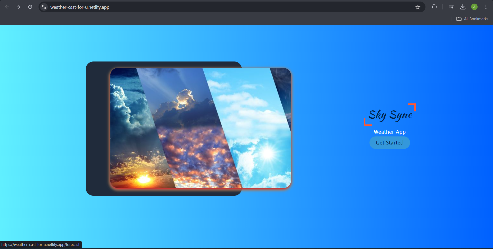
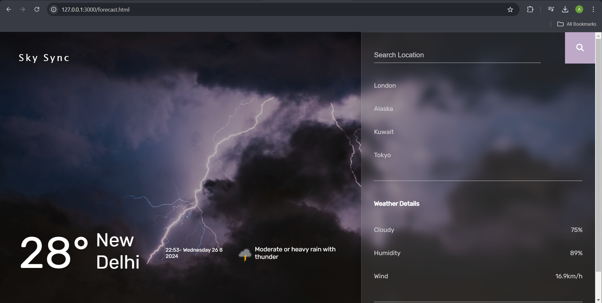

# Sky Sync 🌤️

Welcome to **Sky Sync** - a sleek and modern weather forecasting application that delivers real-time weather updates with stunning visuals. Powered by the [WeatherAPI](https://www.weatherapi.com/), Sky Sync offers an intuitive and visually appealing way to stay updated with the latest weather conditions from around the world.

## Features ✨

### Elegant Cover Page 🖼️

- **Unique Design:** The application opens with a beautifully designed cover page that sets the tone for a smooth user experience.
- **Get Started:** A simple, inviting button leads you to explore the app's full features.

### Real-Time Weather Updates 🌍

- **Search Functionality:** Search for your desired location and get instant weather updates.
- **Dynamic Background:** The background image of the forecast page changes according to the weather conditions (e.g., sunny, cloudy, rainy) to provide an immersive experience.
- **Weather Details:** Displays detailed weather information such as temperature, humidity, wind speed, and more.

### API Integration 🔄

- **Live Data:** Sky Sync fetches real-time weather data from [WeatherAPI](https://www.weatherapi.com/), ensuring that you always have the most accurate weather information at your fingertips.


## Preview 🎨

### Index Page
The entry point to Sky Sync, featuring a visually engaging interface that makes weather forecasting an enjoyable experience.



### Forecast Page
A sleek forecast page where you can search for any city worldwide. Watch as the background dynamically updates based on the current weather conditions in the searched location.



## How It Works 🛠️

1. **Enter a City Name:** Use the search bar on the forecast page to enter the name of a city.
2. **Fetch Weather Data:** Sky Sync connects to the WeatherAPI to fetch real-time weather data for the entered location.
3. **Dynamic Update:** The page instantly updates to reflect the weather conditions with appropriate background images and weather details.

## Installation and Setup 🚀

1. **Clone the repository:**
   ```bash
   git clone https://github.com/Aslam-Moinuddin/sky-sync.git
2. **Navigate to the project directory:**
   ```bash
   cd sky-sync
3. **Open with Live Preview: You can open the project with a live preview in your preferred editor.**
